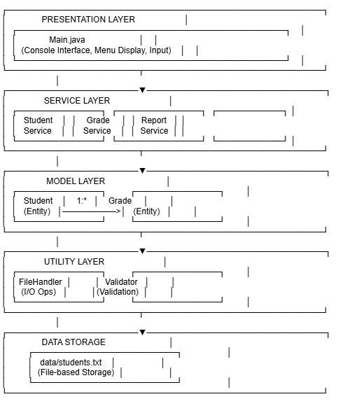
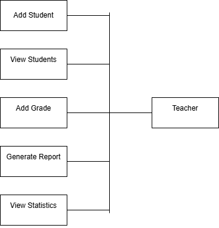
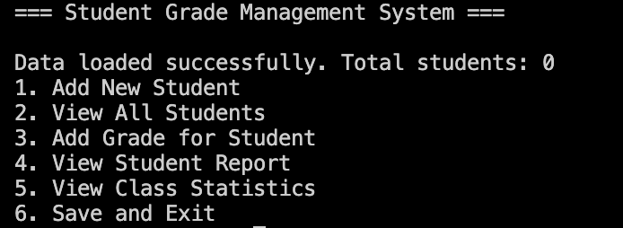
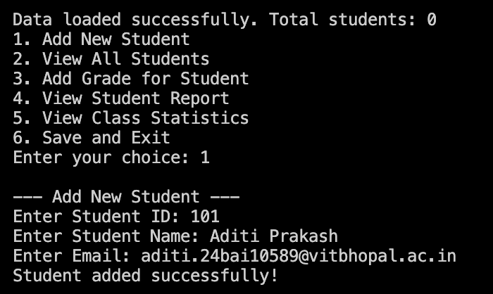
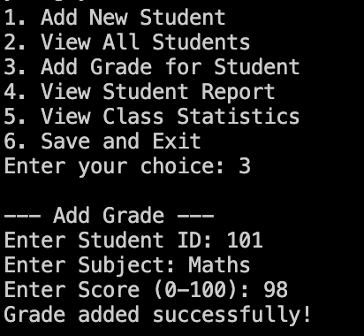
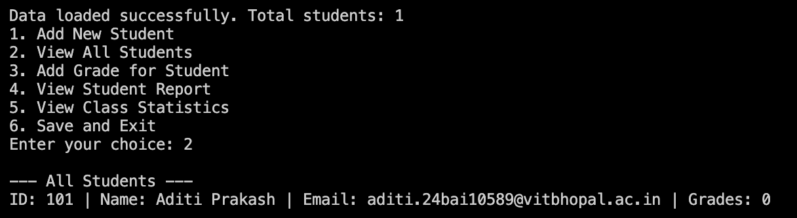
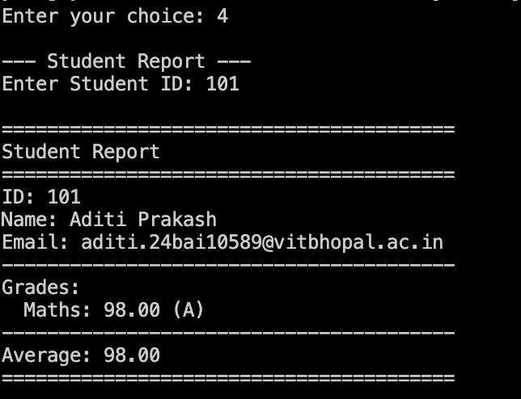
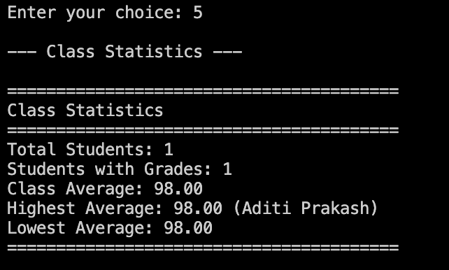

<div align="center">

<br/>

```
  ███████╗████████╗██╗   ██╗██████╗ ███████╗███╗   ██╗████████╗
  ██╔════╝╚══██╔══╝██║   ██║██╔══██╗██╔════╝████╗  ██║╚══██╔══╝
  ███████╗   ██║   ██║   ██║██║  ██║█████╗  ██╔██╗ ██║   ██║   
  ╚════██║   ██║   ██║   ██║██║  ██║██╔══╝  ██║╚██╗██║   ██║   
  ███████║   ██║   ╚██████╔╝██████╔╝███████╗██║ ╚████║   ██║   
  ╚══════╝   ╚═╝    ╚═════╝ ╚═════╝ ╚══════╝╚═╝  ╚═══╝   ╚═╝   
             G R A D E   M A N A G E M E N T   S Y S T E M
```

<br/>

[](https://www.java.com)
[](https://github.com/AzhaanGlitch/VITyarthi-Project)
[](LICENSE)
[]()

<br/>

> **A clean, console-based Java application for managing student records, grades, and academic reports — built with OOP principles and file-based persistence.**

<br/>

</div>

---

## 📌 Table of Contents

- [Overview](#-overview)
- [Features](#-features)
- [Project Structure](#-project-structure)
- [Technologies Used](#-technologies-used)
- [Installation & Setup](#-installation--setup)
- [How to Use](#-how-to-use)
- [System Diagrams](#-system-diagrams)
- [Screenshots](#-screenshots)
- [Non-Functional Requirements](#-non-functional-requirements)
- [Testing](#-testing)
- [Author](#-author)

---

## 🎯 Overview

The **Student Grade Management System** is a console-driven Java application designed to streamline the management of student information and academic performance. It provides a clean, menu-based interface for educators and administrators to maintain records, compute statistics, and generate structured reports — all without the need for a database or external dependencies.

---

## ✨ Features

| Feature | Description |
|--------|-------------|
| 🧑‍🎓 **Student Management** | Add, view, and search student records |
| 📝 **Grade Recording** | Record subject-wise grades per student |
| 📊 **Report Generation** | View individual student reports and class-wide statistics |
| 💾 **Data Persistence** | Save and reload data using file I/O |
| 🛡️ **Input Validation** | Robust error handling for invalid or edge-case inputs |
| 📋 **Class Reports** | Aggregate performance summaries across all students |

---

## 🗂️ Project Structure

```
JAVA_PROJECT_ADITI/
│
├── 📁 src/
│   ├── 📁 models/
│   │   ├── Student.java          # Student entity model
│   │   └── Grade.java            # Grade entity model
│   │
│   ├── 📁 services/
│   │   ├── StudentService.java   # Business logic for students
│   │   ├── GradeService.java     # Business logic for grades
│   │   └── ReportService.java    # Report generation logic
│   │
│   ├── 📁 utils/
│   │   ├── FileHandler.java      # File read/write operations
│   │   └── Validator.java        # Input validation utilities
│   │
│   └── Main.java                 # Application entry point
│
├── 📁 data/
│   └── students.txt              # Persistent student data store
│
├── 📁 docs/
│   ├── 📁 diagrams/
│   │   ├── 01-use-case-diagram.png
│   │   ├── 02-class-diagram.png
│   │   ├── 03-sequence-diagram.png
│   │   ├── 04-architecture-diagram.png
│   │   ├── 05-er-diagram.png
│   │   └── 06-process-flow-diagram.png
│   │
│   └── 📁 screenshots/
│       ├── main_menu.png
│       ├── add_student.png
│       ├── add_grade.png
│       ├── view_students.png
│       ├── student_report.png
│       └── class_report.png
│
├── .gitignore
├── HowToRun.txt
├── ProjectReport.pdf
└── README.md
```

---

## 🛠️ Technologies Used

- **Language**: Java 11+
- **Paradigm**: Object-Oriented Programming (OOP)
- **Data Storage**: File I/O (`java.io` / `java.nio`)
- **Collections**: Java Collections Framework (`ArrayList`, `HashMap`)
- **Build**: Manual `javac` compilation (no Maven/Gradle required)

---

## ⚙️ Installation & Setup

### Prerequisites

- ✅ Java Development Kit (JDK) **11 or higher**
- ✅ Git

### Steps to Run

**1. Clone the repository**
```bash
git clone https://github.com/AzhaanGlitch/VITyarthi-Project.git
cd JAVA_PROJECT_ADITI
```

**2. Compile the source files**
```bash
javac -d bin src/models/*.java src/services/*.java src/utils/*.java src/Main.java
```

**3. Run the application**
```bash
java -cp bin Main
```

> 💡 Refer to [`HowToRun.txt`](HowToRun.txt) for platform-specific instructions.

---

## 🖥️ How to Use

Once launched, the application presents an interactive menu:

```
╔══════════════════════════════════════╗
║     STUDENT GRADE MANAGEMENT SYSTEM  ║
╠══════════════════════════════════════╣
║  1. Add New Student                  ║
║  2. Add Grade for a Student          ║
║  3. View All Students                ║
║  4. View Student Report              ║
║  5. View Class Statistics            ║
║  6. Exit                             ║
╚══════════════════════════════════════╝
```

- Enter the number corresponding to your desired action
- Follow on-screen prompts to input student data and grades
- Reports are generated and displayed instantly in the console

---

## 📐 System Diagrams

### 🏛️ System Architecture
> High-level overview of the application's layered structure.



---

### 👤 Use Case Diagram
> Interactions between the user (actor) and system features.



---

### 🧱 Class Diagram
> Relationships between Java classes across models, services, and utilities.


---

### 🔄 Sequence Diagram
> Step-by-step message flow for key operations.


---

### 🗄️ ER Diagram
> Entity-Relationship model for the data structures used.


---

### 🔁 Process Flow Diagram
> End-to-end process flow from launch to data persistence.


---

## 📸 Screenshots

### 🏠 Main Menu
> The primary navigation screen displayed on application launch.



---

### ➕ Add Student
> Interface for entering a new student's name and ID.



---

### 📝 Add Grade
> Screen for recording a subject-wise grade for an existing student.



---

### 👁️ View Students
> Tabular listing of all registered students.



---

### 📄 Student Report
> Detailed academic report for an individual student.



---

### 📊 Class Report
> Aggregated statistics and performance summary for the entire class.



---

## 📋 Non-Functional Requirements

| Requirement | Specification |
|------------|---------------|
| ⚡ **Performance** | All operations respond within **1 second** |
| 🖱️ **Usability** | Simple numbered menu — no learning curve |
| 🔒 **Reliability** | Data persists across sessions via file storage |
| 🧩 **Maintainability** | Modular architecture with clear separation of concerns |
| 🛡️ **Robustness** | Handles invalid inputs gracefully without crashing |

---

## 🧪 Testing

Testing is performed manually through the console interface. Scenarios covered:

- ✅ Valid student registration and grade entry
- ✅ Invalid inputs — negative grades, empty names, duplicate IDs
- ✅ Edge cases — minimum (0) and maximum (100) grade values
- ✅ File persistence — data correctly saved and reloaded across sessions
- ✅ Report accuracy — averages and statistics verified manually

---

## 👩‍💻 Author

**Aditi** — *JAVA_PROJECT_ADITI*

[](https://github.com/AzhaanGlitch/VITyarthi-Project)

---

<div align="center">

<br/>

*Built with ☕ Java and a commitment to clean, maintainable code.*

<br/>

</div>
